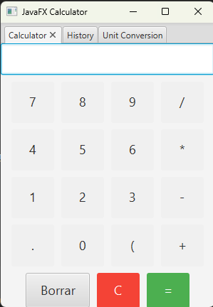

 # JavaFX Calculator

 Una sencilla y elegante calculadora construida con JavaFX.

 ## Descripción

 Esta calculadora soporta las operaciones básicas de suma, resta, multiplicación y división.
 También se pueden usar paréntesis para definir la prioridad de las operaciones.
 Adicionalmente, cuenta con una pestaña de historial que muestra los cálculos anteriores y una funcionalidad de conversión de unidades.

 ## Cómo ejecutar

 1. Asegúrate de tener JavaFX configurado en tu sistema.
 2. Compila y ejecuta el archivo `Javafx.java`.

 ## Características

 - Interfaz gráfica intuitiva.
 - Soporte para paréntesis.
 - Diseño moderno y elegante.
 - Historial de cálculos recientes.
 - Función de conversión de unidades entre metros, kilómetros, centímetros y milímetros.

 ## Captura de pantalla

 [Imagen de la calculadora en acción]

 

 Nota: Puedes agregar una imagen de tu calculadora, solo asegúrate de incluir la ruta correcta).

 ## Contribuciones

 Las contribuciones son bienvenidas. Por favor, abre un issue para discutir lo que te gustaría cambiar o agregar.

 ## Licencia

 [MIT](https://choosealicense.com/licenses/mit/)
